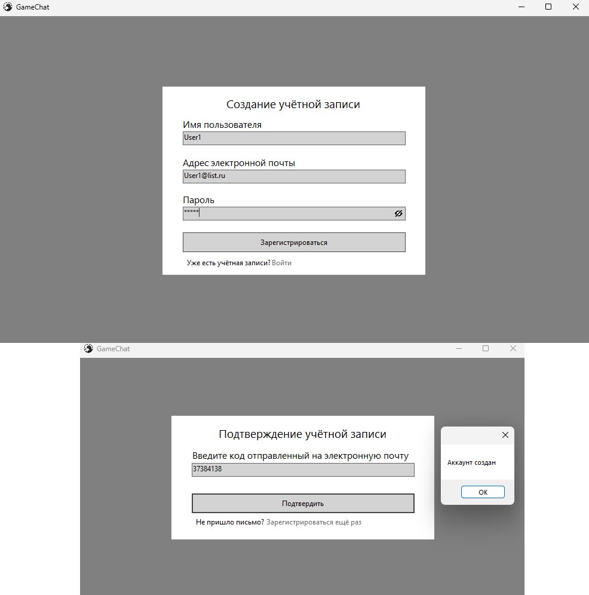
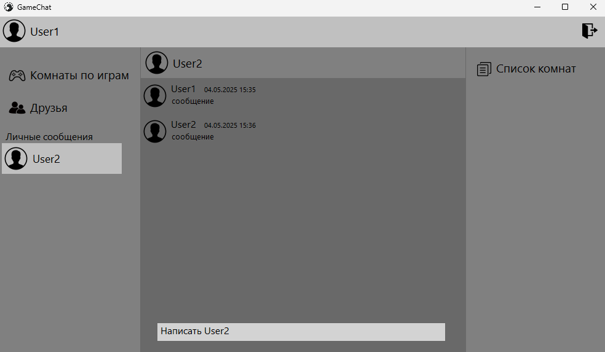

# 🎮 GameChat

**Игровой мессенджер с клиент-серверной архитектурой на WCF и TCP/IP**

---

## 📌 О проекте

**GameChat** — дипломный проект, демонстрирующий построение **распределённой системы** для обмена текстовыми сообщениями в реальном времени.  

Проект показывает понимание:
- клиент-серверной архитектуры
- сетевого взаимодействия (TCP/IP, WCF)
- проектирования реляционных БД
- разработки десктопных интерфейсов (WinForms)

> Проект создавался в сжатые сроки перед защитой и армией, поэтому **основной фокус сделан на бэкенд и сетевое взаимодействие**, а не на идеальную безопасность или архитектуру. Код демонстрирует мой уровень на момент окончания обучения (2025).

---

## 🛠️ Технологический стек

| Компонент | Технология |
| :--- | :--- |
| **Язык программирования** | C# (.NET Framework 4.8) |
| **Клиент** | Windows Forms (минимальный UI для демонстрации) |
| **Сервер** | WCF (Windows Communication Foundation) |
| **Сетевой протокол** | TCP/IP |
| **База данных** | Microsoft SQL Server (SSMS) |
| **Взаимодействие** | Callback-контракты для push-уведомлений |

---

## 🏗️ Архитектура

Приложение построено по классической **трёхуровневой модели**:

1. **Клиент (WinForms)** — интерфейс, отображение сообщений, ввод данных.
2. **Сервер (WCF)** — бизнес-логика, управление соединениями, трансляция сообщений между клиентами.
3. **База данных (SQL Server)** — хранение пользователей, сообщений, комнат, друзей.

**Ключевые особенности реализации:**
- Сервер предоставляет два WCF-сервиса:
  - `Service` — авторизация, регистрация, управление комнатами и друзьями.
  - `Service2` — обмен сообщениями в реальном времени через callback-интерфейсы (push-уведомления клиентам).
- Транспорт: **TCP/IP** (надёжная связь между удалёнными компьютерами).

---

## 🗄️ Модель базы данных

### ER-диаграмма


### Сущности и атрибуты

| Сущность | Атрибуты |
| :--- | :--- |
| **Users** | `user_id` (PK), `user_name`, `email`, `password`, `status` (в сети / не в сети) |
| **Friends** | `friends_id` (PK), `userSender_id` (FK), `userRecipient_id` (FK), `status` (отправлен / принят / отклонён) |
| **FriendMessages** | `message_id` (PK), `sender_id` (FK), `recipient_id` (FK), `message` (text), `message_date`, `status` (прочитано / не прочитано) |
| **Games** | `game_id` (PK), `game_name`, `game_image` |
| **Rooms** | `room_id` (PK), `game_id` (FK), `room_name`, `password`, `members_current`, `members_max` |
| **RoomMembers** | `roomMember_id` (PK), `user_id` (FK), `room_id` (FK), `status` (создатель / участник / выгнан) |
| **RoomMessages** | `roomMessage_id` (PK), `room_id` (FK), `sender_id` (FK), `message` (text), `message_date` |

---

### ⚙️ Основной функционал (бэкенд-логика)

*Здесь показаны ключевые серверные решения: сеть, БД, архитектура. Скриншоты интерфейса лишь иллюстрируют результат.*

---

#### 1. Регистрация пользователя — проверка и сохранение

**Задача:**  
Проверить, что пользователь с таким именем или email ещё не зарегистрирован, затем сохранить данные в БД.

**Код сервера (WCF-метод `Reg`):**

```csharp
public string Reg(string userName, string Email, string password)
{
    string answer;
    SqlConnection connection = new SqlConnection(connectionString);
    connection.Open();
    string query = $"insert into Users(user_name, Email, password, status) values('{userName}','{Email}','{password}','не всети')";
    SqlCommand cmd = new SqlCommand(query, connection);
    if (cmd.ExecuteNonQuery() == 1)
        answer = "аккаунт зарегистрирован";
    else
        answer = "ошибка";
    connection.Close();
    return answer;
}
```
**Результат:**



После успешной регистрации пользователь попадает на форму авторизации.

---

#### 2. WCF-конфигурация для TCP-транспорта

**Задача:**  
Настроить сервер для приёма подключений по TCP с возможностью callback-уведомлений.

**Конфигурация (`app.config` сервера):**

```xml
<?xml version="1.0" encoding="utf-8" ?>
  <configuration>
    <startup> 
      <supportedRuntime version="v4.0" sku=".NETFramework,Version=v4.8" />
    </startup>
    <system.serviceModel>
      <bindings>
        <netTcpBinding>
          <binding name="LargeMessageBinding" maxReceivedMessageSize="2147483647">
            <security mode="None">
              <transport clientCredentialType="None" />
            </security>
          </binding>
        </netTcpBinding>
      </bindings>
      <behaviors>
        <serviceBehaviors>
          <behavior name="mexBeh">
            <serviceMetadata httpGetEnabled="true" httpsGetEnabled="true" />
            <serviceDebug includeExceptionDetailInFaults="true" />
          </behavior>
        </serviceBehaviors>
      </behaviors>
      <services>
        <service behaviorConfiguration="mexBeh" name="WCF.Service">
          <endpoint address="" binding="netTcpBinding" bindingConfiguration="LargeMessageBinding" contract="WCF.IService" />
          <endpoint address="mex" binding="mexHttpBinding" contract="IMetadataExchange" />
          <host>
            <baseAddresses>
              <add baseAddress="http://ip:port" />
              <add baseAddress="net.tcp://ip:port" />
            </baseAddresses>
          </host>
        </service>
          <service behaviorConfiguration="mexBeh" name="WCF.Service2">
          <endpoint address="" binding="netTcpBinding" bindingConfiguration="LargeMessageBinding" contract="WCF.IService2" />
          <endpoint address="mex" binding="mexHttpBinding" contract="IMetadataExchange" />
          <host>
            <baseAddresses>
            <add baseAddress="http://ip:port" />
            <add baseAddress="net.tcp://ip:port" />
            </baseAddresses>
          </host>
        </service>
      </services>
    </system.serviceModel>
  </configuration>
```
**Результат:**
Клиенты могут подключаться к серверу по TCP и вызывать его методы.

---

#### 3. Callback-контракт для мгновенных уведомлений

**Задача:**
Сервер должен отправлять клиенту новые сообщения без запроса со стороны клиента (push-уведомления).

**Контракт на сервере:**

```csharp
public interface IService2Callback
{
    [OperationContract(IsOneWay = true)]
    void SendMessageFriendCallback(string message, string sender, DateTime dateTime);
}
```
**Реализация на клиенте:**

```csharp
public class CallbackHandler : IService2Callback
{
    public void SendMessageFriendCallback(string message, string sender, DateTime dateTime)
    {
        // Вывод сообщения в чат
        AppendMessage(sender, message, dateTime);
    }
}
```
**Результат:**



Сообщение появляется у получателя мгновенно, как только сервер его сохранил.

---

#### 4. Отправка сообщения — транзакция + уведомление

**Задача:**
Сохранить сообщение в БД и, если получатель онлайн, отправить ему уведомление через callback.

**Код сервера:**

```csharp
public string SendMessageFriend(string message, string sender, string recipient, DateTime dateTime)
{
    string answer;
    SqlConnection connection = new SqlConnection(connectionString);
    connection.Open();

    string query = $"insert into FriendMessages(sender_id, recipient_id, message, message_date, status) " +
                   $"values((select user_id from Users where user_name = '{sender}'), " +
                   $"(select user_id from Users where user_name = '{recipient}'), " +
                   $"'{message}', '{dateTime}', 'не прочитано')";

    SqlCommand cmd = new SqlCommand(query, connection);
    if (cmd.ExecuteNonQuery() == 1)
    {
        answer = "сообщение отправлено";
        foreach (var user in users)
            if (user.user_name == recipient)
                user.operationContext.GetCallbackChannel<IService2Callback>()
                    .SendMessageFriendCallback(message, sender, dateTime);
    }
    else answer = "ошибка";

    connection.Close();
    return answer;
}
```
**Результат:**
Сообщение сохраняется в БД и мгновенно доставляется онлайн-получателю.

---

## 📂 Содержимое репозитория

- `GameChat/` — исходный код клиента и сервера.
- `DataBase/` — база данных.
- `диплом.pdf` — пояснительная записка (со сканами подписей).
- `презентация.pptx` — презентация к защите.

---

## 📝 Примечание для рекрутеров

Этот проект наглядно демонстрирует мое понимание:
*   **C# и .NET Framework**
*   **Клиент-серверной архитектуры**
*   **Сетевого взаимодействия (WCF, TCP/IP)**
*   **Проектирования реляционных баз данных (SQL Server)**
*   **Многопоточности и асинхронных операций**
*   **Разработки распределенных систем**

Код не безупречен с точки зрения безопасности (SQL-инъекции, открытые пароли), а пользовательский интерфейс сделан максимально просто — я целенаправленно фокусируюсь на бэкенд-разработке, а не на UI/фронтенде. Однако проект демонстрирует, что я **умею строить работающие распределённые системы** и **могу быстро наверстать современные практики** — в этом я уже продвинулся в последующих проектах.

---

## 📜 Лицензия

Этот проект является учебным и распространяется в ознакомительных целях.
