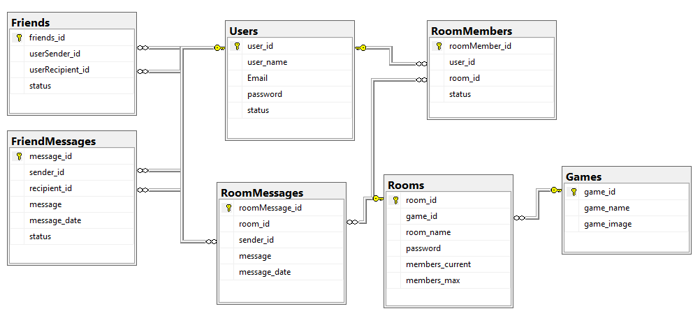

# 🎮 GameChat

**Игровой мессенджер с клиент-серверной архитектурой на WCF и TCP/IP**

---

## 📌 О проекте

**GameChat** — дипломный проект, демонстрирующий построение **распределённой системы** для обмена текстовыми сообщениями в реальном времени.  

Проект показывает понимание:
- клиент-серверной архитектуры
- сетевого взаимодействия (TCP/IP, WCF)
- проектирования реляционных БД
- разработки десктопных интерфейсов (WinForms)

> Проект создавался в сжатые сроки перед защитой и армией, поэтому **основной фокус сделан на бэкенд и сетевое взаимодействие**, а не на идеальную безопасность или архитектуру. Код демонстрирует мой уровень на момент окончания обучения (2025).

---

## 🛠️ Технологический стек

| Компонент | Технология |
| :--- | :--- |
| **Язык программирования** | C# (.NET Framework 4.8) |
| **Клиент** | Windows Forms (минимальный UI для демонстрации) |
| **Сервер** | WCF (Windows Communication Foundation) |
| **Сетевой протокол** | TCP/IP |
| **База данных** | Microsoft SQL Server (SSMS) |
| **Взаимодействие** | Callback-контракты для push-уведомлений |

---

## 🏗️ Архитектура

**Приложение реализовано по классической **трёхуровневой модели** с четким разделением ответственности:**
- Уровень представления (WinForms): Отвечает за пользовательский интерфейс и ввод данных.
- Уровень бизнес-логики (WCF): Ядро системы, реализующее всю логику мессенджера — аутентификацию, управление комнатами и друзьями, а также трансляцию сообщений.
- Уровень данных (SQL Server): Обеспечивает хранение и целостность данных пользователей, сообщений и комнат.

**Ключевые особенности реализации:**
- Сервер предоставляет два WCF-сервиса:
  - `Service` — авторизация, регистрация, управление комнатами и друзьями.
  - `Service2` — обмен сообщениями в реальном времени через callback-интерфейсы (push-уведомления клиентам).
- Транспорт: **TCP/IP** (надёжная связь между удалёнными компьютерами).

---

## 🗄️ Модель базы данных

### ER-диаграмма



### Сущности и атрибуты

| Сущность | Атрибуты |
| :--- | :--- |
| **Users** | `user_id` (PK), `user_name`, `email`, `password`, `status` (в сети / не в сети) |
| **Friends** | `friends_id` (PK), `userSender_id` (FK), `userRecipient_id` (FK), `status` (отправлен / принят / отклонён) |
| **FriendMessages** | `message_id` (PK), `sender_id` (FK), `recipient_id` (FK), `message` (text), `message_date`, `status` (прочитано / не прочитано) |
| **Games** | `game_id` (PK), `game_name`, `game_image` |
| **Rooms** | `room_id` (PK), `game_id` (FK), `room_name`, `password`, `members_current`, `members_max` |
| **RoomMembers** | `roomMember_id` (PK), `user_id` (FK), `room_id` (FK), `status` (создатель / участник / выгнан) |
| **RoomMessages** | `roomMessage_id` (PK), `room_id` (FK), `sender_id` (FK), `message` (text), `message_date` |

---

### ⚙️ Ключевые бэкенд-механизмы

*Ниже представлены ключевые серверные механизмы приложения: регистрация и авторизация, настройка WCF‑транспорта, обмен сообщениями в реальном времени через callback‑контракты и управление игровыми комнатами.*

---

#### 1. Аутентификация и управление пользователями

**Задача:**  
Проверить существование пользователя по имени или email, зарегистрировать нового пользователя, аутентифицировать по email и паролю.

**Код сервера:**

```csharp
public string login(string Email, string password)
{
    string answer;
    SqlConnection connection = new SqlConnection(@"Data Source=DENNY\SERVER;Initial Catalog=GameChat;Integrated Security=True");
    connection.Open();

    SqlDataAdapter adapter = new SqlDataAdapter();
    DataTable table = new DataTable();
    string query = $"select Email from Users where Email = '{Email}'";
    SqlCommand cmd = new SqlCommand(query, connection);
    adapter.SelectCommand = cmd;
    adapter.Fill(table);
    if (table.Rows.Count > 0)
    {
        table = new DataTable();
        query = $"select Email, password from Users where Email = '{Email}' and password = '{password}'";
        cmd = new SqlCommand(query, connection);
        adapter.SelectCommand = cmd;
        adapter.Fill(table);
        if (table.Rows.Count > 0) answer = "вход";
        else answer = "неправильный пароль";
    }
    else answer = "неверный Email";

    connection.Close();
    return answer;
}

public string Reg(string userName, string Email, string password)
{
    string answer;
    SqlConnection connection = new SqlConnection(@"Data Source=DENNY\SERVER;Initial Catalog=GameChat;Integrated Security=True");
    connection.Open();

    string query = $"insert into Users(user_name, Email, password, status) values('{userName}', '{Email}', '{password}', 'не всети')";
    SqlCommand cmd = new SqlCommand(query, connection);
    if (cmd.ExecuteNonQuery() == 1) answer = "аккаунт зарегистрирован";
    else answer = "ошибка";

    connection.Close();
    return answer;
}
```
> **Результат:** Клиент получает статус операции и реагирует соответствующим образом. Асинхронная обработка запросов обеспечивает отзывчивость интерфейса.

---

#### 2. Конфигурация WCF-транспорта (HTTP + TCP)

**Серверная часть использует два транспортных протокола:**  
HTTP – для публикации метаданных (WSDL) и обмена служебной информацией.  
TCP – для высокопроизводительной передачи данных между клиентом и сервером (сообщения в реальном времени).

**Конфигурация сервера:**

```xml
<services>
  <service behaviorConfiguration="mexBeh" name="WCF.Service">
    <endpoint address="" binding="netTcpBinding" bindingConfiguration="LargeMessageBinding"
      contract="WCF.IService" />
    <endpoint address="mex" binding="mexHttpBinding" contract="IMetadataExchange" />
    <host>
      <baseAddresses>
        <add baseAddress="http://192.168.0.138:8001" />
        <add baseAddress="net.tcp://192.168.0.138:8002" />
      </baseAddresses>
    </host>
  </service>
  <service behaviorConfiguration="mexBeh" name="WCF.Service2">
    <endpoint address="" binding="netTcpBinding" bindingConfiguration="LargeMessageBinding"
      contract="WCF.IService2" />
    <endpoint address="mex" binding="mexHttpBinding" contract="IMetadataExchange" />
    <host>
      <baseAddresses>
        <add baseAddress="http://192.168.0.138:8003" />
        <add baseAddress="net.tcp://192.168.0.138:8004" />
      </baseAddresses>
    </host>
  </service>
</services>
```
**Конфигурация клиента:**

```xml
<client>
  <endpoint address="net.tcp://94.233.10.179:8004/" binding="netTcpBinding"
    bindingConfiguration="NetTcpBinding_IService2" contract="Service2.IService2"
    name="NetTcpBinding_IService2" />
  <endpoint address="net.tcp://94.233.10.179:8002/" binding="netTcpBinding"
    bindingConfiguration="NetTcpBinding_IService" contract="Server.IService"
    name="NetTcpBinding_IService" />
</client>
```
> **Результат:** Клиент подключается по TCP, а разработчик может получать метаданные через HTTP. Это позволяет разделить служебный и основной трафик.

---

#### 3. Push-уведомления через callback-контракты

Для мгновенной доставки сообщений используется callback-интерфейс: сервер вызывает метод на клиенте, когда получает новое сообщение для онлайн‑пользователя.

**Контракт на сервере:**

```csharp
[ServiceContract(CallbackContract = typeof(IService2CallBack))]
public interface IService2
{
    [OperationContract]
    void Connect(string user_name);
    [OperationContract]
    void Disconnect(string user_name);
    [OperationContract]
    string SendMessageFriend(string message, string sender, string recipient, DateTime dateTime);
    [OperationContract]
    string SendMessageInRoom(int room_id, string sender_name, string message, DateTime dateTime);
    [OperationContract]
    string ban(int room_id, string user_name, string game);
}

public interface IService2CallBack
{
    [OperationContract(IsOneWay = true)]
    void SendMessageFriendCallBack(string message, string sender, DateTime dateTime);
    [OperationContract(IsOneWay = true)]
    void SendMessageInRoomCallBack(int room_id, string sender_name, string message, DateTime dateTime);
    [OperationContract(IsOneWay = true)]
    void banCallBack(int room_id, string game);
}
```
**Реализация отправки личного сообщения:**

```csharp
public string SendMessageFriend(string message, string sender, string recipient, DateTime dateTime)
{
    string answer;
    SqlConnection connection = new SqlConnection(@"Data Source=DENNY\SERVER;Initial Catalog=GameChat;Integrated Security=True");
    connection.Open();

    string query = $"insert into FriendMessages(sender_id, recipient_id, message, message_date, status) " +
                   $"values((select user_id from Users where user_name = '{sender}'), (select user_id from Users where user_name = '{recipient}'), " +
                   $"'{message}', '{dateTime}', 'не прочитано')";
    SqlCommand cmd = new SqlCommand(query, connection);
    if (cmd.ExecuteNonQuery() == 1)
    {
        answer = "сообщение отправлено";
        for (int i = 0; i < users.Count; i++) 
            if (users[i].user_name == recipient) 
                users[i].operationContext.GetCallbackChannel<IService2CallBack>().SendMessageFriendCallBack(message, sender, dateTime);
    }
    else answer = "ошибка";

    connection.Close();
    return answer;
}
```
**Реализация callback на клиенте:**

```csharp
public void SendMessageFriendCallBack(string message, string sender, DateTime dateTime)
{
    mainScreen.sendMessageFriendCallBack(message, sender, dateTime);
}
```
> **Результат:** Сообщение сохраняется в БД и мгновенно доставляется онлайн-получателю. При закрытом чате пользователь видит уведомление о непрочитанном сообщении.

---

#### 4. Мультиплеерный чат: управление комнатами и баны

**Задача:**
Сохранить сообщение в БД и, если получатель онлайн, отправить ему уведомление через callback.

**Создание комнаты:**

```csharp
public string createRoom(string user_creator, string game, string room_name, string password, int members_max)
{
    string answer;
    SqlConnection connection = new SqlConnection(@"Data Source=DENNY\SERVER;Initial Catalog=GameChat;Integrated Security=True");
    connection.Open();

    SqlDataAdapter adapter = new SqlDataAdapter();
    DataTable table = new DataTable();
    string query = $"select room_name from Rooms where game_id = (select game_id from Games where game_name = '{game}') and room_name = '{room_name}';";
    SqlCommand cmd = new SqlCommand(query, connection);
    adapter.SelectCommand = cmd;
    adapter.Fill(table);
    if (table.Rows.Count < 1)
    {
        // вставка комнаты и добавление создателя в RoomMembers
        adapter = new SqlDataAdapter();
        if (members_max > 0) query = $"insert into Rooms(game_id, room_name, password, members_current, members_max) " +
                                     $"values((select game_id from Games where game_name = '{game}'), '{room_name}', '{password}', {1}, {members_max});";
        else query = $"insert into Rooms(game_id, room_name, password, members_current, members_max) " +
                     $"values((select game_id from Games where game_name = '{game}'), '{room_name}', '{password}', null, null);";
        cmd = new SqlCommand(query, connection);
        adapter.SelectCommand = cmd;
        if (cmd.ExecuteNonQuery() == 1)
        {
            adapter = new SqlDataAdapter();
            query = $"insert into RoomMembers(user_id, room_id, status) " +
                    $"values((select user_id from Users where user_name = '{user_creator}'), " +
                    $"(select room_id from Rooms where room_name = '{room_name}' and game_id = (select game_id from Games where game_name = '{game}')), 'создатель')";
            cmd = new SqlCommand(query, connection);
            adapter.SelectCommand = cmd;
            cmd.ExecuteNonQuery();

            answer = "комната создана";
        }
        else answer = "ошибка";
    }
    else answer = "Имя комнаты уже существует в этой игре";

    connection.Close();
    return answer;
}
```
**Отправка сообщения в комнату:**

```csharp
public string SendMessageInRoom(int room_id, string sender_name, string message, DateTime dateTime)
{
    string answer = "";
    SqlConnection connection = new SqlConnection(@"Data Source=DENNY\SERVER;Initial Catalog=GameChat;Integrated Security=True");
    connection.Open();

    string query = $"insert into RoomMessages(room_id, sender_id, message, message_date) " +
                   $"values({room_id}, (select user_id from Users where user_name = '{sender_name}'), '{message}', '{dateTime}')";
    SqlCommand cmd = new SqlCommand(query, connection);
    if (cmd.ExecuteNonQuery() == 1)
    {
        answer = "сообщение отправлено";
        
        // Получить всех участников комнаты (кроме отправителя) и отправить им callback
        SqlDataAdapter adapter = new SqlDataAdapter();
        DataTable table = new DataTable();
        query = $"select Users.user_name from RoomMembers " +
                $"join Users on RoomMembers.user_id = Users.user_id " +
                $"where RoomMembers.room_id = {room_id} and RoomMembers.status != 'забанен' and Users.user_name != '{sender_name}'";
        cmd = new SqlCommand(query, connection);
        adapter.SelectCommand = cmd;
        adapter.Fill(table);
        if (table.Rows.Count > 0)
        {
            for (int i = 0; i < users.Count; i++)
            {
                for (int j = 0; j < table.Rows.Count; j++)
                {
                    if (users[i].user_name == table.Rows[j][0].ToString())
                    {
                        users[i].operationContext.GetCallbackChannel<IService2CallBack>().SendMessageInRoomCallBack(room_id, sender_name, message, dateTime);
                        break;
                    }
                }
            }
        }
    }
    else answer = "ошибка";

    connection.Close();
    return answer;
}
```
**Бан пользователя в комнате:**

```csharp
public string ban(int room_id, string user_name, string game)
{
    string answer;
    SqlConnection connection = new SqlConnection(@"Data Source=DENNY\SERVER;Initial Catalog=GameChat;Integrated Security=True");
    connection.Open();

    string query = $"update RoomMembers set status = 'забанен' " +
                   $"where room_id = {room_id} " +
                   $"and user_id = (select user_id from Users where user_name = '{user_name}');\r\n" +
                   $"update Rooms set members_current = members_current - 1 where room_id = {room_id};";
    SqlCommand cmd = new SqlCommand(query, connection);
    if (cmd.ExecuteNonQuery() == 2) answer = "пользователь забанен";
    else answer = "ошибка";
    try
    {
        for (int i = 0; i < users.Count; i++) 
            if (users[i].user_name == user_name) 
                users[i].operationContext.GetCallbackChannel<IService2CallBack>().banCallBack(room_id, game);
    }
    catch { }

    connection.Close();
    return answer;
}
```
> **Результат:** Создаются комнаты с гибкими настройками (пароль, лимит участников). Все участники получают сообщения в реальном времени, а бан блокирует доступ и закрывает форму на клиенте.

---

## 📂 Содержимое репозитория

- `GameChat/` — исходный код клиентcого приложения.
- `Server_GameChat/` — исходный код код серверной программы.
- `DataBase/` — файл для создания базы данных.
- `диплом.pdf` — пояснительная записка (со сканами подписей).
- `презентация.pptx` — презентация к защите.

---

## 📝 Примечание для рекрутеров
**Ключевые навыки, которые демонстрирует этот проект:**
- 🚀 Разработка на C# и .NET Framework
- 🏗️ Клиент-серверная архитектура и WCF
- 🌐 Сетевое взаимодействие по TCP/IP
- 🗄️ Проектирование реляционных БД (SQL Server)
- 📨 Асинхронная обработка и push-уведомления

Код, представленный в проекте, отражает мой уровень на момент окончания обучения. Он не лишен недостатков с точки зрения безопасности (например, уязвимость к SQL-инъекциям и хранение паролей в открытом виде), а интерфейс на WinForms намеренно выполнен минималистично, так как мой основной фокус — бэкенд-разработка. Главная ценность этого проекта — в демонстрации способности построить работающую распределённую систему с сетевым взаимодействием в реальном времени. За время, прошедшее после защиты, я значительно углубил свои знания в области архитектуры и безопасности, что подтверждается моими последующими проектами.

---

## 📜 Лицензия

Этот проект является учебным и распространяется в ознакомительных целях.
